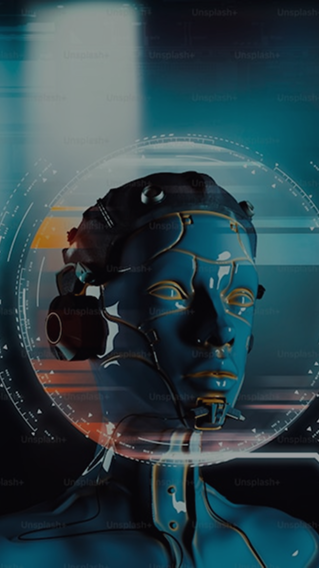

  

# Portafolio Web

Bienvenido a mi portafolio profesional.  
Este proyecto fue creado con el objetivo de **conseguir trabajo**, **mostrar mis proyectos**, y **compartir conocimientos** que fui adquiriendo a lo largo de mi camino como desarrollador.

---

## Sobre mí

Soy **Santacruz José Alberto**, desarrollador **Backend con habilidades Frontend**, ubicado en **Jardín América, Misiones — Argentina**.  

Mi objetivo principal es aportar valor a una empresa, crecer junto a su equipo, desarrollarme profesionalmente y seguir creando soluciones eficientes.

---

## Tecnologías y Herramientas

### **Frontend**
- Figma  
- HTML5  
- CSS3  
- JavaScript  

### **Backend**
- Python  
- Programación Orientada a Objetos (POO)  
- SQL (MySQL)  
- NoSQL (MongoDB)  
- Django  
- Django REST Framework  
- Diseño de Bases de Datos  

### **Otros**
- Git & GitHub  
- Normalización de bases de datos  
- Diagramas entidad-relación  

---

---

## Secciones del Portafolio

✔ Inicio  
✔ Blog 
✔ Proyectos  
✔ CV  
✔ Contacto  

---

## Proyecto Destacado: Mi Portafolio

Este repositorio corresponde a mi portafolio personal, donde muestro mis tecnologías, proyectos, experiencia y conocimientos.

**Características principales:**
- Diseño responsive  
- Estructura modular  
- Código limpio y organizado  
- Integración de secciones educativas  
- Uso eficiente de assets e imágenes  

---

## Contacto

Si deseas comunicarte conmigo, aquí tienes mis canales genéricos:

- **Email:** contacto@ejemplo.com  
- **GitHub:** https://github.com/usuario  
- **LinkedIn:** https://linkedin.com/in/usuario  
- **Portafolio:** (enlace cuando esté publicado)  
- **CV:** disponible bajo solicitud  

*Puedes reemplazar estos enlaces por los reales cuando los tengas listos.*

---

## Licencia

Este proyecto es de uso personal.  
Puedes explorar, aprender o tomar ideas de la estructura, pero no está permitido copiarlo íntegramente como portafolio propio.

---

## Notas técnicas y resolución de problemas

### 🛠 Bug no corregido (Modal dinámico)

- El modal cargado con `fetch()` no se inicializaba correctamente en Chrome.
- Causa: uso de `DOMContentLoaded` en scripts que se ejecutaban después de que el evento ya había ocurrido.
- El problema no pudo resolverse inicialmente utilizando ChatGPT u otras herramientas automáticas,
  por lo que fue necesario realizar análisis manual del flujo de ejecución y pruebas en distintos navegadores.
- Solución final: inicialización segura usando `document.readyState`
  junto con `script.onload` para garantizar el orden correcto de carga del HTML y el JavaScript.

### 🛠 Bug corregido (Modal dinámico)

- El modal de contacto cargado dinámicamente con `fetch()` no se inicializaba correctamente en **Chrome, Brave y Edge**.
- Causa: uso de `DOMContentLoaded` en scripts que se ejecutaban después de que el evento ya había ocurrido, debido a la carga asíncrona del HTML.
- El problema no fue solucionado inicialmente con ChatGPT, por lo que fue necesario realizar análisis manual del flujo de ejecución y pruebas en múltiples navegadores.
- Solución final: cambio a un patrón de auto-ejecución (IIFE) en `contact-modal.js` y garantía de carga secuencial mediante control explícito del orden de inserción del script dinámico.

